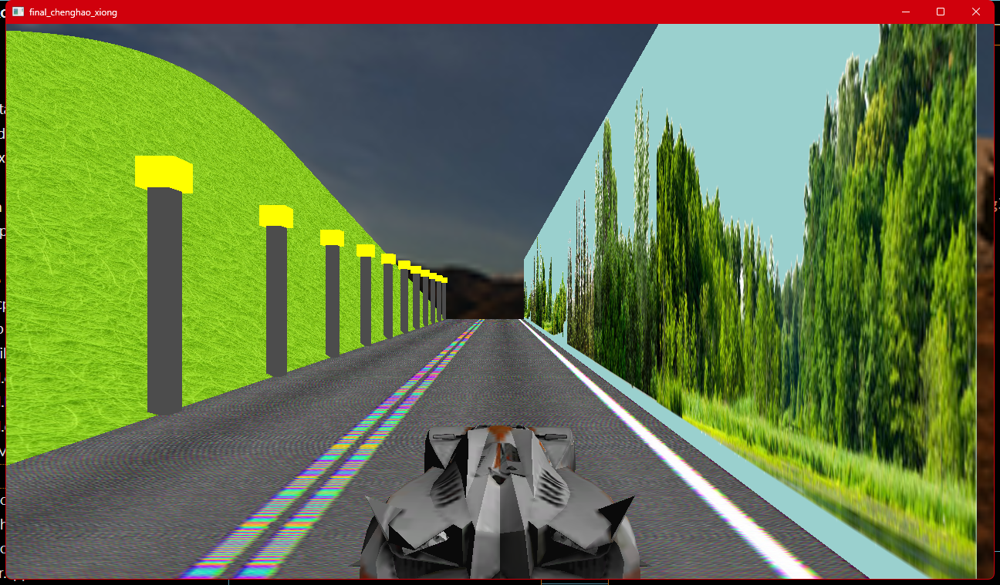

w/W speeds up
s/S slows down
e/E switches the perspective
l/L turns the light on or off
ESC for quit
Press and hold the left mouse button to move the screen angle

Run bash script using ./run.sh

"sudo apt-get update"

"sudo apt-get install libglfw3-dev libgl1-mesa-dev libglu1-mesa-dev libfl-dev libglew-dev freeglut3-dev -y"

This script will install the required dependencies, run the program, 
and delete all dependencies after the program is finished.

"make clean" will delete the compiled files

  

